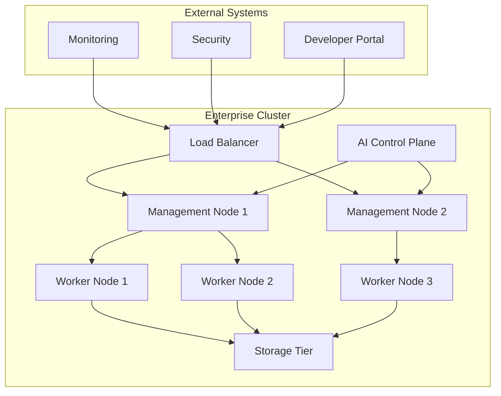

# Aurora OS Phase 3: Enterprise Deployment & AI Integration
## Implementation Roadmap

### 🎯 Phase Overview
Phase 3 transforms Aurora OS from a production-ready system into an enterprise-grade, AI-powered platform capable of large-scale deployment with intelligent automation.

### 📅 Timeline & Milestones

#### **Quarter 1: Foundation (Weeks 1-4)**
**Week 1-2: Enterprise Infrastructure**
- Multi-node clustering implementation
- Advanced load balancing algorithms  
- High availability architecture
- Disaster recovery automation

**Week 3-4: AI Core Enhancement**
- Predictive maintenance systems
- Resource optimization algorithms
- Intelligent workload distribution
- AI-driven security monitoring

#### **Quarter 2: Intelligence (Weeks 5-8)**
**Week 5-6: Enterprise Management**
- Centralized management console
- Real-time monitoring dashboard
- Automated deployment pipelines
- Configuration management system

**Week 7-8: Advanced Security**
- Zero-trust architecture implementation
- Advanced threat detection
- Compliance automation (SOC2, ISO27001)
- Security audit framework

#### **Quarter 3: Scalability (Weeks 9-12)**
**Week 9-10: Performance Optimization**
- Performance benchmarking suite
- Scalability testing framework
- Resource usage optimization
- Network performance enhancement

**Week 11-12: Ecosystem Development**
- Developer API and SDK
- Third-party integration framework
- Plugin system architecture
- Community contribution tools

### 🏗️ Technical Implementation Details

#### **Enterprise Deployment Architecture**



#### **AI Integration Components**

1. **Predictive Analytics Engine**
   - Resource usage prediction
   - Performance bottleneck identification
   - Automated scaling recommendations

2. **Intelligent Security System**
   - Anomaly detection using ML
   - Automated threat response
   - Behavioral analysis

3. **Resource Optimization AI**
   - Dynamic resource allocation
   - Workload balancing optimization
   - Energy efficiency management

#### **Enterprise Features Implementation**

##### **1. Multi-Node Clustering**
```yaml
cluster_config:
  nodes:
    - name: master-1
      role: controller
      ip: 10.0.1.10
    - name: worker-1  
      role: worker
      ip: 10.0.1.20
    - name: worker-2
      role: worker
      ip: 10.0.1.21
  
  networking:
    mesh_networking: true
    service_discovery: consul
    load_balancer: nginx_plus
  
  storage:
    distributed_storage: ceph
    backup_policy: daily_incremental
```

##### **2. Advanced Load Balancing**
- AI-powered traffic distribution
- Health-based routing
- Geographic load distribution
- Automatic failover mechanisms

##### **3. High Availability**
- Active-active controller nodes
- Automated failover (sub-5 second)
- Data replication across nodes
- Disaster recovery automation

#### **AI-Powered Features**

##### **1. Predictive Maintenance**
```python
class PredictiveMaintenance:
    def analyze_system_health(self):
        """Monitor system components and predict failures"""
        metrics = self.collect_performance_metrics()
        predictions = self.ml_model.predict(metrics)
        return self.generate_maintenance_alerts(predictions)
    
    def auto_remediation(self, alert):
        """Automatically resolve common issues"""
        if alert.type == "memory_pressure":
            return self.optimize_memory_usage()
        elif alert.type == "disk_space":
            return self.cleanup_temp_files()
```

##### **2. Intelligent Resource Management**
- Dynamic CPU core allocation
- Memory usage optimization
- Storage tier management
- Network bandwidth allocation

##### **3. AI Security Monitoring**
- Behavioral anomaly detection
- Threat pattern recognition
- Automated incident response
- Security posture assessment

### 🔧 Development Tasks Breakdown

#### **Priority 1: Core Enterprise Features**
1. **Cluster Management System**
   - [ ] Node discovery and registration
   - [ ] Health monitoring and reporting
   - [ ] Automated node provisioning
   - [ ] Cluster scaling automation

2. **Load Balancing Enhancement**
   - [ ] AI-driven traffic distribution
   - [ ] Geographic routing
   - [ ] Application-aware balancing
   - [ ] Real-time performance metrics

3. **High Availability Framework**
   - [ ] Multi-master configuration
   - [ ] Data synchronization
   - [ ] Automatic failover
   - [ ] Recovery procedures

#### **Priority 2: AI Integration**
1. **AI Control Plane Enhancement**
   - [ ] Machine learning model integration
   - [ ] Real-time analytics pipeline
   - [ ] Prediction engine development
   - [ ] Decision-making algorithms

2. **Intelligent Monitoring**
   - [ ] Anomaly detection system
   - [ ] Performance baseline learning
   - [ ] Automated alerting
   - [ ] Root cause analysis

3. **Resource Optimization**
   - [ ] Dynamic resource allocation
   - [ ] Workload prediction
   - [ ] Energy efficiency algorithms
   - [ ] Cost optimization

#### **Priority 3: Security & Compliance**
1. **Advanced Security**
   - [ ] Zero-trust implementation
   - [ ] Behavioral biometrics
   - [ ] Threat intelligence integration
   - [ ] Security automation

2. **Compliance Framework**
   - [ ] SOC2 compliance tools
   - [ ] ISO27001 implementation
   - [ ] GDPR compliance features
   - [ ] Audit trail system

#### **Priority 4: Performance & Scalability**
1. **Performance Optimization**
   - [ ] Benchmark suite development
   - [ ] Performance profiling tools
   - [ ] Optimization algorithms
   - [ ] Resource tuning

2. **Scalability Testing**
   - [ ] Load testing framework
   - [ ] Stress testing automation
   - [ ] Scalability metrics
   - [ ] Bottleneck identification

#### **Priority 5: Developer Experience**
1. **API and SDK Enhancement**
   - [ ] RESTful API development
   - [ ] GraphQL implementation
   - [ ] SDK libraries (multiple languages)
   - [ ] API documentation

2. **Community Tools**
   - [ ] Developer portal
   - [ ] Contribution guidelines
   - [ ] Plugin development framework
   - [ ] Integration examples

### 📊 Success Metrics

#### **Technical Metrics**
- System uptime: >99.99%
- Response time: <100ms (95th percentile)
- Scalability: Support for 10,000+ nodes
- Security: Zero critical vulnerabilities

#### **Business Metrics**
- Enterprise deployment success rate: >95%
- Customer satisfaction: >4.5/5
- Developer adoption: 1,000+ active developers
- Community growth: 10,000+ contributors

#### **AI Performance Metrics**
- Prediction accuracy: >95%
- Anomaly detection: >98% precision
- Resource optimization: 30%+ efficiency gain
- Automated resolution: 80%+ of common issues

### 🚀 Release Plan

#### **Phase 3.1: Enterprise Foundation (Weeks 1-4)**
- Multi-node clustering
- Basic load balancing
- High availability setup

#### **Phase 3.2: AI Intelligence (Weeks 5-8)**
- Predictive maintenance
- Resource optimization
- Security monitoring

#### **Phase 3.3: Advanced Features (Weeks 9-12)**
- Performance optimization
- Developer tools
- Community features

### 🎯 Next Steps

1. **Immediate Actions (This Week)**
   - Monitor CI/CD pipeline stabilization
   - Set up development environment for Phase 3
   - Begin clustering architecture design

2. **Short-term Goals (2 Weeks)**
   - Implement basic multi-node setup
   - Develop cluster management API
   - Create initial AI integration framework

3. **Long-term Vision (3 Months)**
   - Complete enterprise deployment suite
   - Achieve production AI integration
   - Establish developer ecosystem

---
**Document Version**: 1.0  
**Last Updated**: 2025-12-14  
**Phase**: 3 - Enterprise Deployment & AI Integration  
**Status**: Planning Complete - Implementation Ready